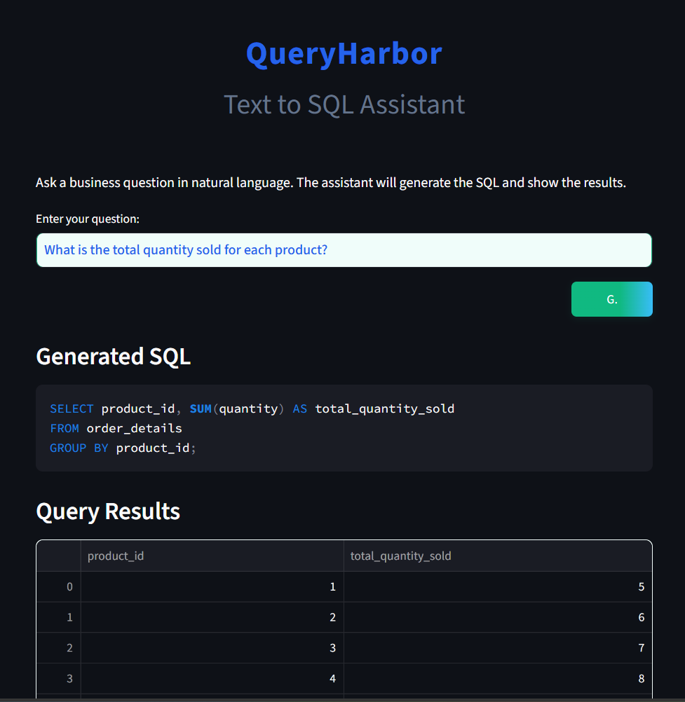
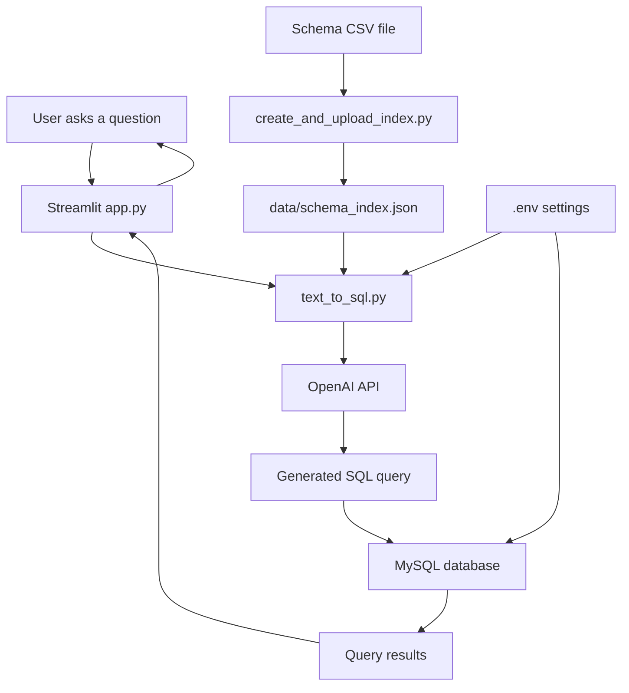

# QueryHarbor: Text to SQL Assistant

A Streamlit web app that converts natural language business questions into SQL queries, executes them on a MySQL database, and displays the results. It uses a local schema index and the standard OpenAI API.



## Architecture



### How It Works

1. The user enters a business question in the Streamlit interface.
2. `app.py` sends the question to `text_to_sql.py`.
3. `text_to_sql.py` searches `data/schema_index.json` for relevant tables and columns.
4. The question and schema details are sent to OpenAI.
5. OpenAI returns a SQL query.
6. `database.py` connects to MySQL and executes the query against the real database.
7. The query results are returned to Streamlit and shown to the user.

The schema index contains table descriptions only. It does not contain the actual customer, order, product, or supplier records. The real records remain in MySQL.

## Features

- Ask business questions in plain English.
- Automatically generates SQL queries using OpenAI.
- Executes queries on a MySQL database and displays results.
- Uses a local JSON schema index for schema-aware context.
- Modern, responsive UI with Streamlit.

## Project Structure

- `app.py` — Main Streamlit app.
- `text_to_sql.py` — Converts questions to SQL using OpenAI and the local schema index.
- `database.py` — Handles MySQL connection and query execution.
- `create_and_upload_index.py` — Builds the local schema index from the CSV file.
- `data/` — Contains CSVs and schema SQL for the sample database.
- `.env` — Environment variables for API keys and DB credentials.
- `requirements.txt` — Python dependencies.

## Setup

### 1. Clone the repository

```sh
git clone <your-repo-url>
cd sql_assistant
```

### 2. Install dependencies

```sh
pip install -r requirements.txt
```

### 3. Configure environment variables

- Copy `.env` and fill in your OpenAI API key and MySQL credentials. Set `OPENAI_MODEL` to choose a different OpenAI model.

### 4. Build the local schema index

```sh
python create_and_upload_index.py
```

### 5. Run the app

```sh
streamlit run app.py
```

## Usage

- Open the Streamlit app in your browser.
- Enter a business question (e.g., "Show total orders by country").
- View the generated SQL and query results.

Example questions:

- What is the total shipping cost for each city?
- What is the total quantity sold for each product?
- How many orders has each customer placed?

## Requirements

- Python 3.8+
- MySQL server
- OpenAI API access

## License

MIT License

---
